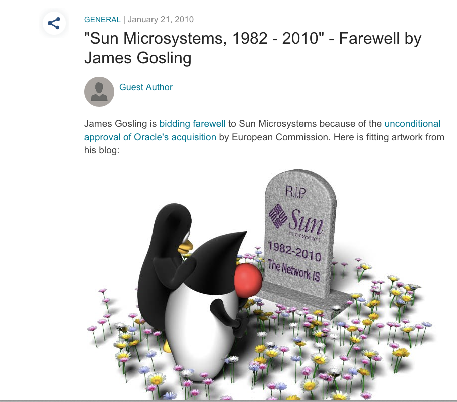
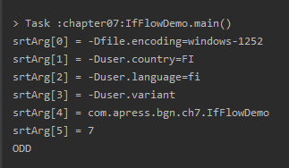
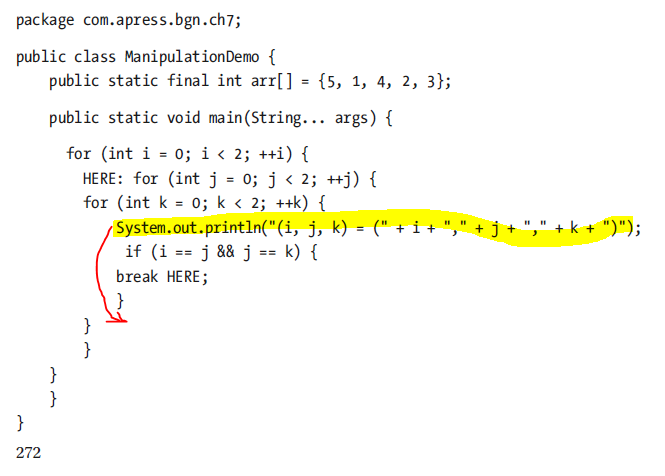

== Errata for Java for Absolute Beginners

=== Introduction
Hi guys, I am really thankful to all of you that have bought the book and have contributed to finding mistakes in it and in the code, and asking questions about details that seem unclear.

In the *Introduction* section there is a phrase that some of the first readers have expressed doubts about: _Java began in 1982 and was created by a handful of people_.
Oracle considers the birth year of Java as 1991, the first year when the Oak language was conceived(http://oracle.com.edgesuite.net/timeline/java/). I scanned  the internet quite throughly
and found little resources related to when the first idea of creating a programming language that would be better than C was born and found a few references to year 1982.
It stuck with me and decided to add the year in the book, because it was quite funny that the programming language that helped me build a career as a developer is almost as old as me.
As the only information I've used in the book is the year number, it did not require a reference, which I now acknowledge it might have been wrong of me.
One of the resources mentioning the James Gosling full connection to Java as the *1982-2010* interval can be found here: https://blogs.oracle.com/arungupta/sun-microsystems,-1982-2010-farewell-by-james-gosling .
And in case this blog entry gets removed too, I've secured a little bit of proof in the following image:

=== Chapter 1: An Introduction to Java and its History

***

On **page 2**, paragraph 3:

The URL https://www.oracle.com/edgesuite.net/timeline/java./ does not work.

Should be replaced with: **http://oracle.com.edgesuite.net/timeline/java/**.

***

On **page 43**, image *2-14*:

The option **GitHub** is depicted as an option to clone the repository for this book.

In more recent versions of IntelliJ IDEA that option is no longer available. You can still clone the repo using the *Git* option.
Depending on the preferred protocol you can use:

 * the Git URL:  git@github.com:Apress/java-for-absolutebeginners.git
 * the HTTPS URL:  https://github.com/Apress/java-for-absolute-beginners.git

***

On **page 44 and 45**:

The *java-for-absolute-beginners* repository is referred to as *java-bgn*

This is the name of the private repository where I initially pushed my sources. The publisher decided a better name would be *java-for-absolute-beginners*.

***

=== Chapter 7: Controlling the Flow
***

On **page 245**, formatting error:

In code snippet of the  **IfFlowDemo** class, **arg0** is used instead of **args[0]**.

_**Observation!!**_ If you are using an operating system that is customized to a different locale than the default one, your program might have extra arguments specific to it.
In this case you have to modify the **IfFlowDemo** class and use a different index than **0**.

One of my readers, named _Vesa Kauranen_ send me a screenshot with the arguments added by default when running the  **IfFlowDemo** on a Windows instance configured for Finland.

***

On **page 272**:

In the **ManipulationDemo** class the `System.out.println("(i, j, k) = (" + i + "," + j + "," + k + ")");` statement is misplaced.

The following image  depicts the code in the book with the recommended correction:

The code is correct in this repository and the correct placement can be found in the link:chapter07/src/main/java/com/apress/bgn/ch7/ManipulationDemo.java[ManipulationDemo.java] source file

(Observation submitted by _Vesa Kauranen_)

***