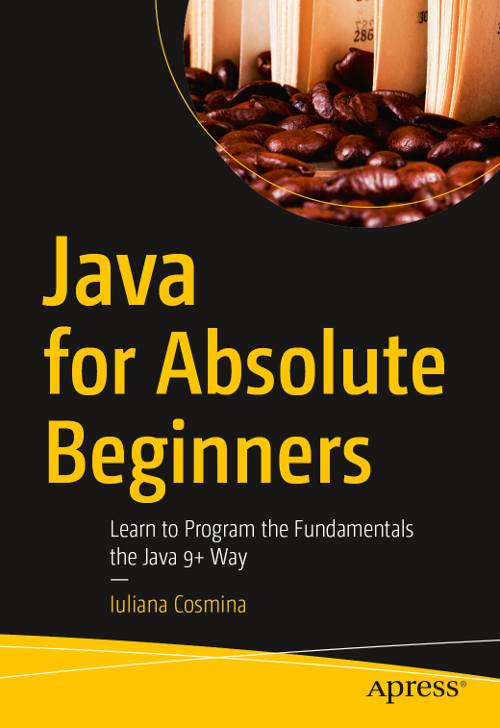

== Apress Source Code

This repository accompanies book *Java for Absolute Beginners* (https://www.apress.com/in/book/9781484237779) by Iuliana Cosmina(Apress, 2018).

Download the files as a zip using the green button, or clone the repository to your machine using Git.

== Releases
Release v1.0 corresponds to the code in the published book, without corrections or updates.

== Corrections
For corrections to the content in the published book, see the file errata.md.

== Contributions
See the file Contributing.adoc for more information on how you can contribute to this repository.

== Building and Deploying
This is a Gradle multi-module project. Build it from scratch using:
----
gradle clean build
----

Build it without tests using:
----
gradle build -x test 
----

Build it and copy dependencies into build/libs using:
----
gradle clean build copyDependencies
----

